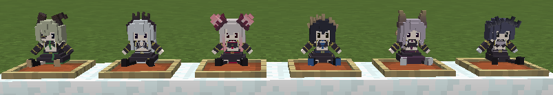

# HNST Dolls

## これは何？
VTuberグループ「ハニーストラップ」のメンバーの人形を追加するMinecraft用リソースパックです。  
以下のアイテムの見た目を人形に変更します。
- 赤色の色付きガラス
- 白色の色付きガラス
- 緑色の色付きガラス
- 青色の色付きガラス
- 紫色の色付きガラス
- 灰色の色付きガラス

※設置状態のブロックの見た目は変更されません。額縁に入れて飾ると良い感じです。

## 対応バージョン
Minecraft 1.13 以降

## 導入方法
1. [ココ](https://github.com/inema11/HNST_dolls/releases/download/v1.0.0/hnst_dolls-1.0.0.zip)からzipファイルをダウンロード
2. Minecraftゲームフォルダ内にある`resourcepacks`フォルダにダウンロードしたzipファイルを移動
3. ゲーム内で [設定] → [リソースパック] を開き、↑で移動させたzipファイル名のリソースパックを選択

## 変更履歴
- v1.0.0 [2019/06/23]
  - リソースパックを公開
    
## 注意事項
本リソースパックはVTuberグループ「ハニーストラップ」の二次創作物です。公式に迷惑がかかるような利用はご遠慮下さい。  
連絡先：いねま（[@inema_11](https://twitter.com/inema_11)）

